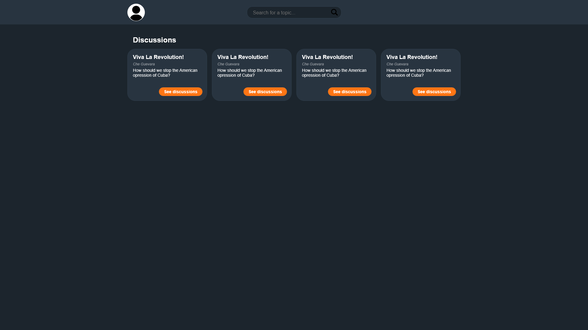
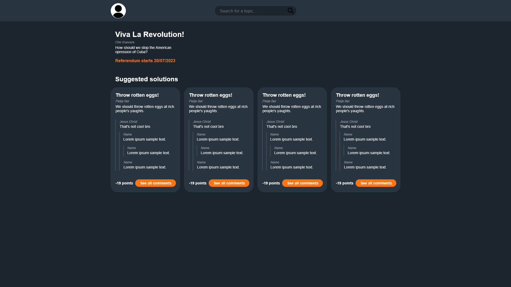
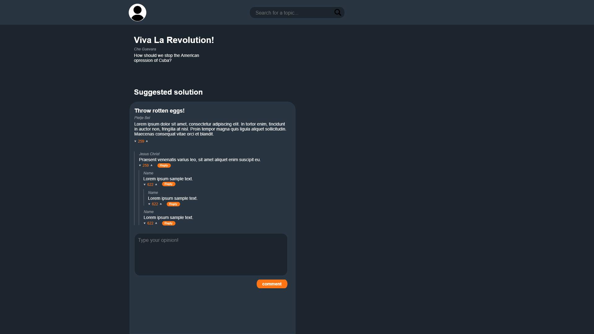
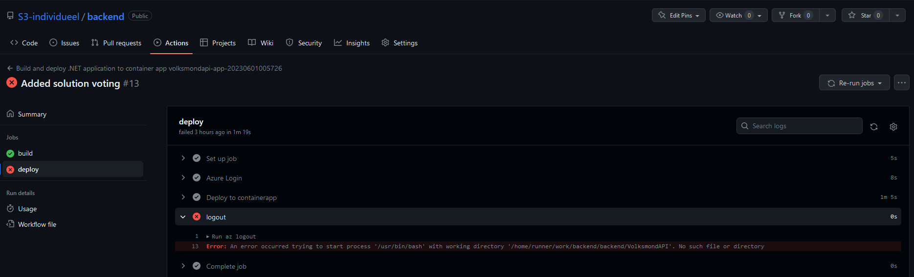
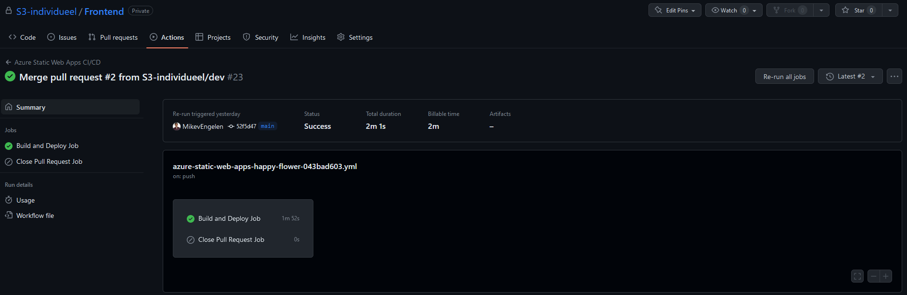
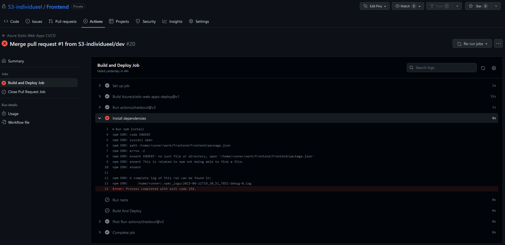
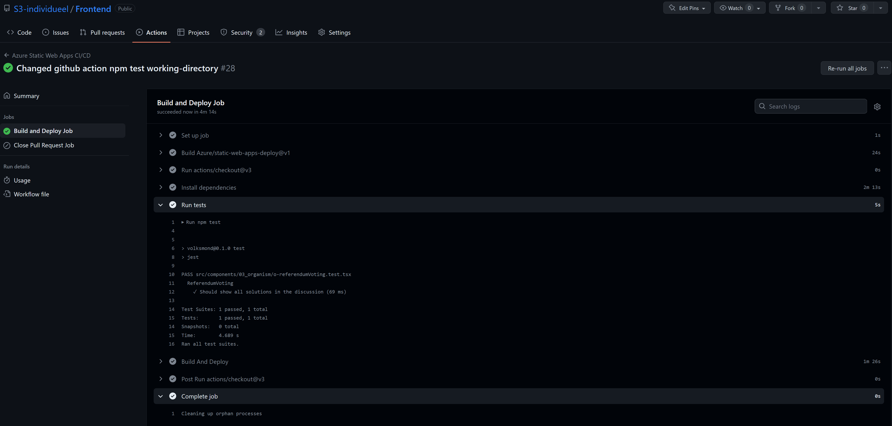
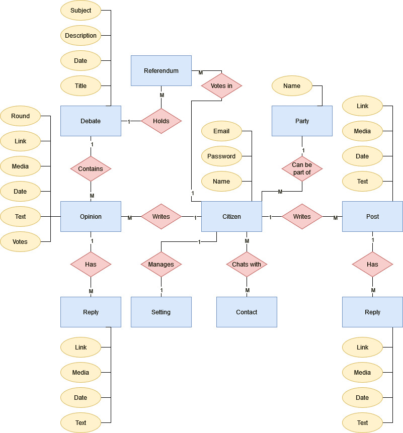
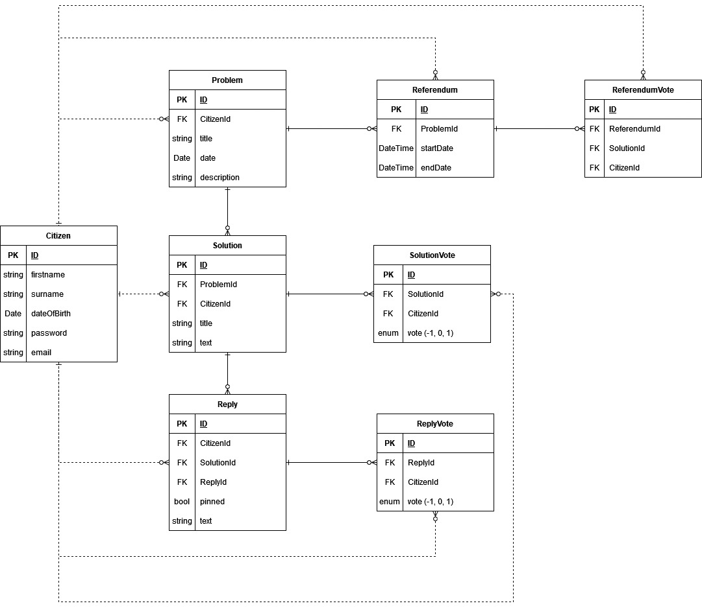

# Semester 3 Portfolio Mike van Engelen

## Table of contents:
- [1. Intdroduction](#Introducation)
- [2. to do list](#To-do)
- [3. Learning Outcomes](#Learning-Outcomes)
  - [3.1 Web Application](#1-Web-application)
  - [3.2 Software Quality](#2-Software-quality)
  - [3.3 Agile Method](#3-Agile-method)
  - [3.4 CI/CD](#4-CI/CD)
  - [3.5 Cultural differences and ethics](#5-Cultural-differences-and-ethics)
  - [3.6 Requirements and Design](#6-Requirements-and-Design)
  - [3.7 Bussiness Process](#7-Bussiness-Process)
  - [3.8 Professional](#8-Professional)

## Introducation:

This Git repository contains all my projects, documentation and where to find everything

## Documentation
This folder contains all the documentation for my reasearches, designs and choices.

## Learning Outcomes
This folder contains both the Learning outcomes for the Group Project and the learning outcomes for the Individual Learning outcomes.

## Project
This folder contains all the project information. It consists of all the code and other information. 

# To do:

## Learning Outcome 1: Web Application (IP)(#learning-outcome-1-web-application-ip)
*You design and build **user-friendly**, **full-stack** web applications.*
- [ ] project Structure
- [ ] project ORM
- [ ] project Frontend
- [ ] project backend
- [ ] project (final finished)

## Learning Outcome 1: Web Application (GP)(#learning-outcome-1-web-application-gp)
*You design and build **user-friendly**, **full-stack** web applications.*
- [ ] GroopySwoopy Back end 
- [ ] GroopySwoopy Front end

## Learning Outcome 2: Software Quality(#learning-outcome-2-software-quality)
*You use software **tooling and methodology** that continuously monitors and improve the software quality during software development.*
- [ ] testen (https://fhict.instructure.com/courses/12992/pages/testing-what-when-and-where?module_item_id=911581)
- [ ] code quality (IP)
- [ ] code quality (GP)
- [ ] automated code scanning tool (IP)

## Learning Outcome 3: Agile Method(#learning-outcome-3-agile-method)
*You can implement the software process for your project according to a given agile software development method.*
- [ ] Research Scrum
- [ ] Research waterfall
- [ ] Research Kanban

## Learning Outcome 4: CI/CD(#learning-outcome-4-cicd)
*You **implement** a (semi)automated software release process that matches the needs of the project context.*
- [ ] Setting up CI
- [ ] setting up CD
- [ ] CI/CD (GP) (partial)

## Learning Outcome 5: Cultural Differences and Ethics(#learning-outcome-5-cultural-differences-and-ethics)
*You **recognize** and **take into account** cultural differences when working with multi-site teams and are aware of ethical aspects in software development.*
- [ ] group management
- [ ] software ethics 

## Learning Outcome 6: Design (GP + IP)(#learning-outcome-6-requirements)
*You translate (non-functional) requirements to extend existing (architectural) designs and can validate them using **multiple types of test techniques**.*
- [ ] Research on basics
- [ ] design (working on it)
- [ ] testing

## Learning Outcome 7: Business processes(#learning-outcome-7-business-processes)
*You can explain **simple** business processes and **relate** them to the development of your software project.*
- [ ] analyzing and modeling an exisitng business process in project
- [ ] analyzing process and improving on conclusions
- [ ] modeled new process and improved involment of roles in project
 
## Learning Outcome 8: Professional (IP)(#learning-outcome-8-professional-ip)(#learning-outcome-8-professional-ip)
*You act in a **professional manner** during software development and learning.*
- [ ] 
- [ ] 
- [ ] 

## Learning Outcome 8: Professional (GP)(#learning-outcome-8-professional-gp)(#learning-outcome-8-professional-gp)
*You act in a **professional manner** during software development and learning.*
- [ ] Team Communication
- [ ] Communication with the Stakeholders

## Learning Outcomes:

| # | Name | Short description | Clarification |
|---|------|-------------------|---------------|
| 1 | Web application | You design and build **user-friendly, full-stack** web applications. | **User friendly:** You apply basic User experience testing and development techniques. **Full-stack:** You design and build a full stack application using commonly accepted front end (Javascript-based framework) and back end techniques (e.g. Object Relational Mapping) choosing and implementing relevant communication protocols and addressing asynchronous communication issues. |
| 2 | Software quality | You use software **tooling and methodology** that continuously monitors and improve the software quality during software development. | **Tooling and methodology:** Carry out, monitor and report on unit integration, regression and system tests, with attention for security and performance aspects, as well as applying static code analysis and code reviews. |
| 3 | Agile method | You **choose** and implement the most suitable agile software development method for your software project. | **Agile method:** You are aware of the most popular agile methods and their underlying agile principles. You are able to implement the process of your software project according to a chosen methodology. |
| 4 | CI/CD | You **implement** a (semi)automated software release process that matches the needs of the project context. | **Implement:** You implement a continuous integration and deployment solution (using e.g. Gitlab CI and Docker). |
| 5 | Cultural differences and ethics | You **recognize** and **take into account** cultural differences between project stakeholders and ethical aspects in software development. | **Recognize**:  Recognition is based on theoretically substantiated awareness of cultural differences and ethical aspects in software engineering. **Take into account:** Adapt your communication, working, and behavior styles to work with other developers from different cultures; Address one of the standard Programming Ethical Guidelines (e.g., ACM Code of Ethics and Professional Conduct) in your work. |
| 6 | Requirements and Design | You analyze (non-functional) requirements, elaborate (architectural) designs and validate them using **multiple types of test techniques**. | **Multiple types of test techniques:** You apply user acceptance testing and stakeholder feedback to validate the quality of the requirements. You evaluate the quality of the design (e.g., by testing or prototyping) taking into account the formulated quality properties like security and performance. |
| 7 | Business processes | You analyze and describe **simple** business processes that are **related** to your project. | **Simple:** predominantly sequential processes with one or two alternative paths. **Related:** understanding the relationships between the process and software. |
| 8 | Professional | You act in a **professional manner** during software development and learning. | **Professional manner:** You develop software as a team effort according to a prescribed software methodology and following team agreements. You are able to track your work progress and communicate your progress with the team. understanding the relationships between the process and software. |

## 1 Web application

You design and build user-friendly, full-stack web applications.

Clarification:

User friendly: You apply basic User experience testing and development techniques.

Full-stack: You design and build a full stack application using commonly accepted front end (Javascript-based framework) and back end techniques (e.g. Object Relational Mapping) choosing and implementing relevant communication protocols and addressing asynchronous communication issues.

### how I plan to show this learning outcome in my project: 

For this project I'll be making a full stack application with a React frontend for some extra software quality. I choose React because it is generally the most used javascript-framework for frontend development, so I found it useful to learn. Also I have some previous experience with VueJS and wanted to expand my knownledge by trying something slightly different.
I opted to write React in TypeScript for extra software quality thanks to it's typed nature. This prevents unexpected errors and catches them before even building the project. I have virtually no experience with TypeScript.

The web API will be build with ASP.NET Web API core, which we also use in the group-project and is thus easier to learn over the course of the semester. The API is connected with an Azure hosted SQL database through Entity Framework core (code-first) because it integrates nicely with ASP.NET.
When using Entity Framework I've learned it can be fiddly with changes made to the models. New migrations might not be able to update the database properly and require a full database and migration sweep.

To get a sense of what I have to built I made a few designs. The style is inspired by Reddit, since it's the inspiration structure of the project.

**Homepage with all posted problems**

**Problem page with all posted solutions**

**Solution page with all comments**

## 2 Software quality

You use software tooling and methodology that continuously monitors and improve the software quality during software development. 

Clarification:

Tooling and methodology: Carry out, monitor and report on unit integration, regression and system tests, with attention for security and performance aspects, as well as applying static code analysis and code reviews.

### how I plan to show this learning outcome in my project: 

There are multiple ways to test an application. For my project I intent to use User Experience testing (UX), Unit testing (backend) and Integration testing (frontend).

### UX tests
**Objective:** Making sure users understand the intended use and effortlessly navigate the application.

Xamara (My girlfriend): She found the design very simplistic and lacking context, but when I told her the concept and explained it a bit she began to understand the UI more. She said the structure makes sense and also figured I used Reddit as an inspiration, especially for the comments. She suggested showing more information in all cards to provide more context for the user.

### Unit tests
**Objective:** Making sure that users can vote and reply on replies.
RepliesController 
- Verify that a user can upvote a reply.
- Verify that a user can remove a vote on a reply.
- Verify that a user can reply on another reply recursively.

### Intgration tests
**Objective:** Making sure that the frontend and backend API communicate as expected.
Homepage
- Verify that discussions load.

Discussion page
- Verify that all solutions load.
- Verify that users can vote on a solution only during a referendum.

## 3 Agile method

You can implement the software process for your project according to a given agile software development method.

Clarification:

Agile method: You are aware of most popular agile methods and their underlying agile principles. You are able to implement the process of your software project according to a chosen methodology.

### how I plan to show this learning outcome in my project: 

## 4 CI/CD

You implement a (semi)automated software release process that matches the needs of the project context.

Clarification:

Implement: You implement a continuous integration and delivery solution (using e.g. Gitlab CI and Docker).

### how I plan to show this learning outcome in my project: 

The backend api is made with Docker gets build and deployed to an Azure Container App whenever a commit is pushed to the GitHub main branch. I would protect the main branch from direct pushes, but that requires upgrading the organization the repository is in.
Github Actions says the action failed, since it throws an error when it tries to logout, but that doesn't impact the deployment itself.

The frontend also gets built and deployed whenever a commit is pushed to the Github main branch. The frontend is hosted as an Azure Static Web App.

I've also tried adding a frontend test to the pipeline, but I get errors because I can't get Jest to work with TypeScript. I've tried to resolve this by letting babel preprocess the .tsx files before the test runs and tried to swap Jest for ts-jest. But I couldn't get any to work.

After more fiddling with the frontend testing, I have got the test to work and included it into the Github Action.

#### After deployment:
https://happy-flower-043bad603.3.azurestaticapps.net/

## 5 Cultural differences and ethics

You recognize and take into account cultural differences when working with multi-site teams, and are aware of ethical aspects in software development.

Clarifications:

Recognize: Recognition is based on theoretically substantiated awareness of cultural differences and ethical aspects in software engineering.

Take into account: Adapt your communication, working, and behavior styles to work with other developers from different cultures; 

Address one of the standard Programming Ethical Guidelines (e.g., ACM Code of Ethics and Professional Conduct) in your work.  

### how I plan to show this learning outcome in my project: 

## What is culture?

## what is my culture?

## What did you do to improve the group communications with respect to cultural differences?

Irrelevant

## 6 Requirements and Design

You translate (non-functional) requirements to extend existing (architectural) designs and can validate them using multiple types of test techniques.

Clarifications:

Multiple types of test techniques: You apply user acceptance testing and stakeholder feedback to validate the quality of the requirements. You evaluate the quality of the design (e.g., by testing or prototyping) taking into account the formulated quality properties like security and performance.

### how I plan to show this learning outcome in my project: 

### Conceptual model

### Database design

Even though I use Entity Framework (code-first) in this project, I still decided to create a database design. This helped me reverse-engineer how the code should look like to help me visualize.

## 7 Bussiness Process

You can explain simple business processes and relate them to the development of your software project.

Clarifications:

Simple: predominantly sequential processes with one or two alternative paths

Relate: understanding the relationships between the process and software.

### how I plan to show this learning outcome in my project: 

## stakeholders analysis:

### what is a stake holder?

### Who are the stakeholders in my project and what are their goals and constraints? 

## Process analysis:

### What is a business process? 

### How does a business proces relate to software applications? 

## Requirements analysis:

## Ethics analysis:

## 8 Professional

You act in a professional manner during software development and learning.

Clarification:

Professional manner: 

You develop software as a team effort according to a prescribed software methodology and following team agreements. You are able to track your work progress and communicate your progress with the team.

You  independently recognize and decide where your knowledge falls short to solve a software problem and  communicate which new knowledge and skills you need to learn.

### how I plan to show this learning outcome in my project: 
