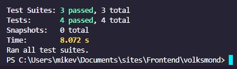
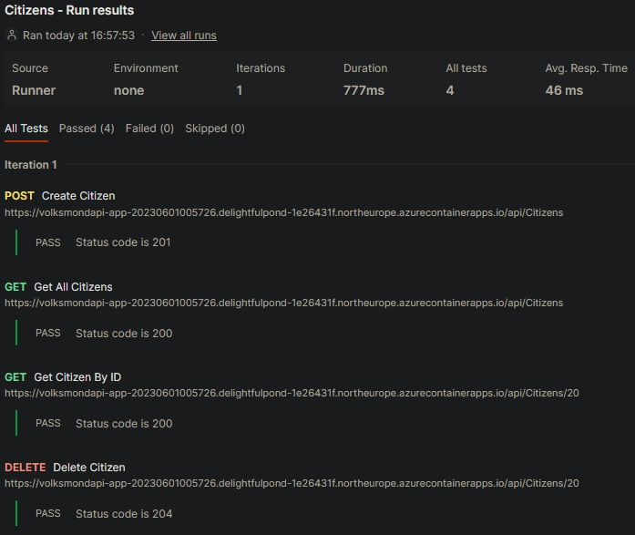
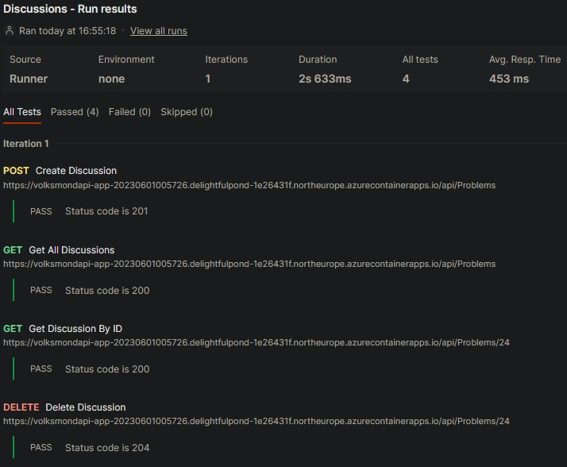
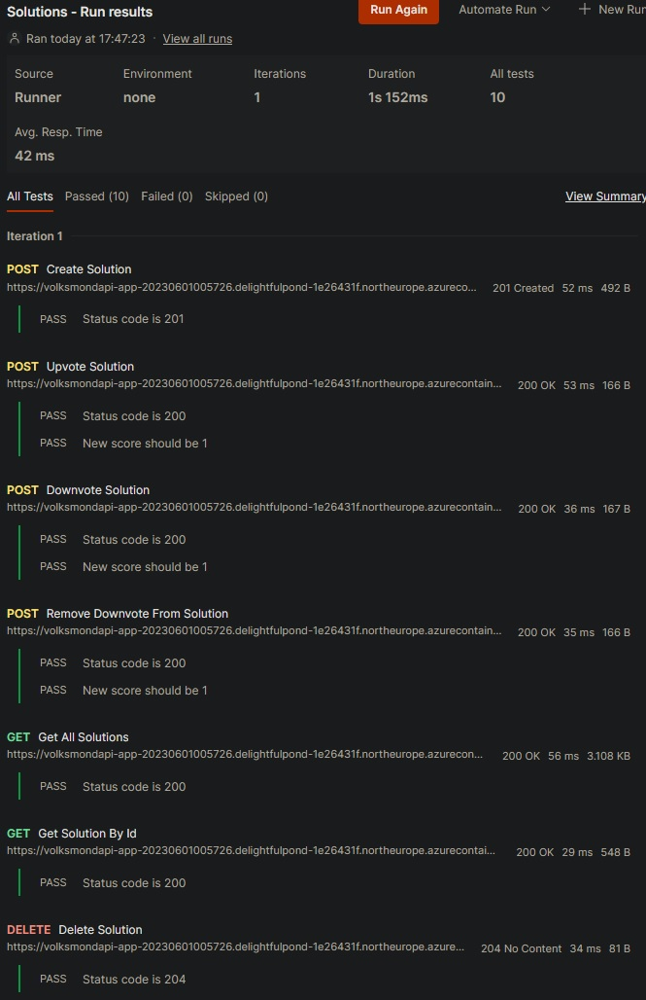
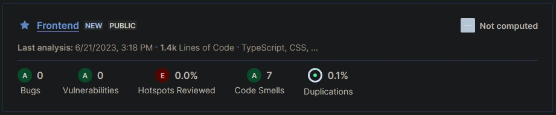
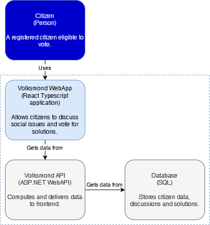
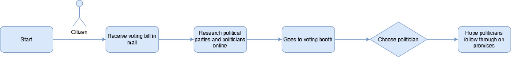
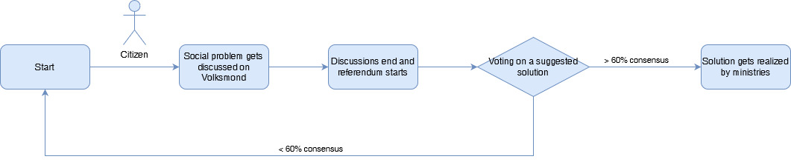

# Semester 3 Portfolio Mike van Engelen

## Table of contents:
- [1. Intdroduction](#Introducation)
- [2. to do list](#To-do)
- [3. Learning Outcomes](#Learning-Outcomes)
  - [3.1 Web Application](#1-Web-application)
  - [3.2 Software Quality](#2-Software-quality)
  - [3.3 Agile Method](#3-Agile-method)
  - [3.4 CI/CD](#4-CI/CD)
  - [3.5 Cultural differences and ethics](#5-Cultural-differences-and-ethics)
  - [3.6 Requirements and Design](#6-Requirements-and-Design)
  - [3.7 Bussiness Process](#7-Bussiness-Process)
  - [3.8 Professional](#8-Professional)

## Introducation:

This Git repository contains all my projects, documentation and where to find everything

## Documentation
This folder contains all the documentation for my reasearches, designs and choices.

## Learning Outcomes
This folder contains both the Learning outcomes for the Group Project and the learning outcomes for the Individual Learning outcomes.

## Project
This folder contains all the project information. It consists of all the code and other information. 

# To do:

## Learning Outcome 1: Web Application (IP)(#learning-outcome-1-web-application-ip)
*You design and build **user-friendly**, **full-stack** web applications.*
- [ ] project Structure
- [ ] project ORM
- [ ] project Frontend
- [ ] project backend
- [ ] project (final finished)

## Learning Outcome 1: Web Application (GP)(#learning-outcome-1-web-application-gp)
*You design and build **user-friendly**, **full-stack** web applications.*
- [ ] GroopySwoopy Back end 
- [ ] GroopySwoopy Front end

## Learning Outcome 2: Software Quality(#learning-outcome-2-software-quality)
*You use software **tooling and methodology** that continuously monitors and improve the software quality during software development.*
- [ ] testen (https://fhict.instructure.com/courses/12992/pages/testing-what-when-and-where?module_item_id=911581)
- [ ] code quality (IP)
- [ ] code quality (GP)
- [ ] automated code scanning tool (IP)

## Learning Outcome 3: Agile Method(#learning-outcome-3-agile-method)
*You can implement the software process for your project according to a given agile software development method.*
- [ ] Research Scrum
- [ ] Research waterfall
- [ ] Research Kanban

## Learning Outcome 4: CI/CD(#learning-outcome-4-cicd)
*You **implement** a (semi)automated software release process that matches the needs of the project context.*
- [ ] Setting up CI
- [ ] setting up CD
- [ ] CI/CD (GP) (partial)

## Learning Outcome 5: Cultural Differences and Ethics(#learning-outcome-5-cultural-differences-and-ethics)
*You **recognize** and **take into account** cultural differences when working with multi-site teams and are aware of ethical aspects in software development.*
- [ ] group management
- [ ] software ethics 

## Learning Outcome 6: Design (GP + IP)(#learning-outcome-6-requirements)
*You translate (non-functional) requirements to extend existing (architectural) designs and can validate them using **multiple types of test techniques**.*
- [ ] Research on basics
- [ ] design (working on it)
- [ ] testing

## Learning Outcome 7: Business processes(#learning-outcome-7-business-processes)
*You can explain **simple** business processes and **relate** them to the development of your software project.*
- [ ] analyzing and modeling an exisitng business process in project
- [ ] analyzing process and improving on conclusions
- [ ] modeled new process and improved involment of roles in project
 
## Learning Outcome 8: Professional (IP)(#learning-outcome-8-professional-ip)(#learning-outcome-8-professional-ip)
*You act in a **professional manner** during software development and learning.*
- [ ] 
- [ ] 
- [ ] 

## Learning Outcome 8: Professional (GP)(#learning-outcome-8-professional-gp)(#learning-outcome-8-professional-gp)
*You act in a **professional manner** during software development and learning.*
- [ ] Team Communication
- [ ] Communication with the Stakeholders

## Learning Outcomes:

| # | Name | Short description | Clarification |
|---|------|-------------------|---------------|
| 1 | Web application | You design and build **user-friendly, full-stack** web applications. | **User friendly:** You apply basic User experience testing and development techniques. **Full-stack:** You design and build a full stack application using commonly accepted front end (Javascript-based framework) and back end techniques (e.g. Object Relational Mapping) choosing and implementing relevant communication protocols and addressing asynchronous communication issues. |
| 2 | Software quality | You use software **tooling and methodology** that continuously monitors and improve the software quality during software development. | **Tooling and methodology:** Carry out, monitor and report on unit integration, regression and system tests, with attention for security and performance aspects, as well as applying static code analysis and code reviews. |
| 3 | Agile method | You **choose** and implement the most suitable agile software development method for your software project. | **Agile method:** You are aware of the most popular agile methods and their underlying agile principles. You are able to implement the process of your software project according to a chosen methodology. |
| 4 | CI/CD | You **implement** a (semi)automated software release process that matches the needs of the project context. | **Implement:** You implement a continuous integration and deployment solution (using e.g. Gitlab CI and Docker). |
| 5 | Cultural differences and ethics | You **recognize** and **take into account** cultural differences between project stakeholders and ethical aspects in software development. | **Recognize**:  Recognition is based on theoretically substantiated awareness of cultural differences and ethical aspects in software engineering. **Take into account:** Adapt your communication, working, and behavior styles to work with other developers from different cultures; Address one of the standard Programming Ethical Guidelines (e.g., ACM Code of Ethics and Professional Conduct) in your work. |
| 6 | Requirements and Design | You analyze (non-functional) requirements, elaborate (architectural) designs and validate them using **multiple types of test techniques**. | **Multiple types of test techniques:** You apply user acceptance testing and stakeholder feedback to validate the quality of the requirements. You evaluate the quality of the design (e.g., by testing or prototyping) taking into account the formulated quality properties like security and performance. |
| 7 | Business processes | You analyze and describe **simple** business processes that are **related** to your project. | **Simple:** predominantly sequential processes with one or two alternative paths. **Related:** understanding the relationships between the process and software. |
| 8 | Professional | You act in a **professional manner** during software development and learning. | **Professional manner:** You develop software as a team effort according to a prescribed software methodology and following team agreements. You are able to track your work progress and communicate your progress with the team. understanding the relationships between the process and software. |

## 1 Web application

You design and build user-friendly, full-stack web applications.

Clarification:

User friendly: You apply basic User experience testing and development techniques.

Full-stack: You design and build a full stack application using commonly accepted front end (Javascript-based framework) and back end techniques (e.g. Object Relational Mapping) choosing and implementing relevant communication protocols and addressing asynchronous communication issues.

### how I plan to show this learning outcome in my project: 

For this project I'll be making a full stack application with a React frontend for some extra software quality. I choose React because it is generally the most used javascript-framework for frontend development, so I found it useful to learn. Also I have some previous experience with VueJS and wanted to expand my knownledge by trying something slightly different.
I opted to write React in TypeScript for extra software quality thanks to it's typed nature. This prevents unexpected errors and catches them before even building the project. I have virtually no experience with TypeScript.

The web API will be build with ASP.NET Web API core, which we also use in the group-project and is thus easier to learn over the course of the semester. The API is connected with an Azure hosted SQL database through Entity Framework core (code-first) because it integrates nicely with ASP.NET.
When using Entity Framework I've learned it can be fiddly with changes made to the models. New migrations might not be able to update the database properly and require a full database and migration sweep.

To get a sense of what I have to built I made a few designs. The style is inspired by Reddit, since it's the inspiration structure of the project.

**Homepage with all posted problems**

**Problem page with all posted solutions**

**Solution page with all comments**

## 2 Software quality

You use software tooling and methodology that continuously monitors and improve the software quality during software development. 

Clarification:

Tooling and methodology: Carry out, monitor and report on unit integration, regression and system tests, with attention for security and performance aspects, as well as applying static code analysis and code reviews.

### how I plan to show this learning outcome in my project: 

There are multiple ways to test an application. For my project I intent to use User Experience testing (UX), Unit testing (backend) and Integration testing (frontend).

### UX tests
**Objective:** Making sure users understand the intended use and effortlessly navigate the application.

Xamara (My girlfriend): She found the design very simplistic and lacking context, but when I told her the concept and explained it a bit she began to understand the UI more. She said the structure makes sense and also figured I used Reddit as an inspiration, especially for the comments. She suggested showing more information in all cards to provide more context for the user.

### Frontend tests
**Objective:** Making sure the frontend renders as expected and that forms work.

For this I have use Jest. The tricky part was forcing Jest to first transform the TypeScript files into readable JavaScript. Also the imports didn't work at first, but had to set isolatedModules in the tsconfig.json to false.

- Verify that the Home Page renders the create citizen form.
- Verify that the Home Page renders the create solution form.
- Verify that the Solution Page renders the suggested solution section.
- Verify that the Referendum Component shows a message when the discussion has no solutions.

### Unit tests
**Objective:** Making sure individual controller functions work as intended.
- Verify that a user can upvote a reply.
- Verify that a user can remove a vote on a reply.
- Verify that a user can reply on another reply recursively.

### Integration tests
**Objective:** Making sure that the backend works and connects and interacts with the database.
I used Postman for this. When an object is Posted, the api sends the ID back. This ID is used as variable for the other requests.

#### Citizen test scenarios:
- Verify that a citizen can be created.
- Verify that all citizens can be fetched.
- Verify that a citizen can be fetched by Id.
- Verify that a citizen can be deleted.

#### Discussion test scenarios:
- Verify that a discussion can be created.
- Verify that all discussions can be fetched.
- Verify that a discussion can be fetched by Id.
- Verify that a discussion can be deleted.

#### Solution test scenarios:
- Verify that a solution can be created.
- Verify that a solution can be upvoted.
- Verify that a solution can be downvoted.
- Verify that a vote can be revoked.
- Verify that all solutions can be fetched.
- Verify that a solution can be fetched by Id.
- Verify that a solution can be deleted.

### Code scan
I've ran my frontend through SolarCloud's code scan for extra software quality control.

## 3 Agile method

You can implement the software process for your project according to a given agile software development method.

Clarification:

Agile method: You are aware of most popular agile methods and their underlying agile principles. You are able to implement the process of your software project according to a chosen methodology.

### how I plan to show this learning outcome in my project: 

As an Associate Degree student I've been given Scrum as Agile method I must apply to my software development process.

Scrum is an iterative process were you get feedback every sprint and apply it in the next sprint. This makes software development more flexible and adaptable to the stake-holders wishes.

Scrum consists of 5 key elements:
1. Product backlog: This is a list of user-stories which are prioritized by the stakeholders wants and needs.
2. Sprint planning: Before the start of every sprint, the developer(s) and the stakeholder(s) prioritize user-stories which ought to be finnished at the end of the sprint.
3. Daily stand-up: At the start of every (work-)day the team gets together for a meeting. The Scrum-master asks everyone what they plan to do that day and ask if they need help.
4. Sprint review: At the end of each sprint, the sprint results are presented to the stakeholders. This is important to get feedback to implement in a future sprint.
5. Sprint Retrospective: The retrospective should happen closely after the sprint review. It's about reflecting on what went well and what went wrong in the development process in the last sprint.

## 4 CI/CD

You implement a (semi)automated software release process that matches the needs of the project context.

Clarification:

Implement: You implement a continuous integration and delivery solution (using e.g. Gitlab CI and Docker).

### how I plan to show this learning outcome in my project: 

The backend api is made with Docker gets build and deployed to an Azure Container App whenever a commit is pushed to the GitHub main branch. I would protect the main branch from direct pushes, but that requires upgrading the organization the repository is in.
Github Actions says the action failed, since it throws an error when it tries to logout, but that doesn't impact the deployment itself.

The frontend also gets built and deployed whenever a commit is pushed to the Github main branch. The frontend is hosted as an Azure Static Web App.

I've also tried adding a frontend test to the pipeline, but I get errors because I can't get Jest to work with TypeScript. I've tried to resolve this by letting babel preprocess the .tsx files before the test runs and tried to swap Jest for ts-jest. But I couldn't get any to work.

After more fiddling with the frontend testing, I have got the test to work and included it into the Github Action.

#### After deployment:
https://happy-flower-043bad603.3.azurestaticapps.net/

## 5 Cultural differences and ethics

You recognize and take into account cultural differences when working with multi-site teams, and are aware of ethical aspects in software development.

Clarifications:

Recognize: Recognition is based on theoretically substantiated awareness of cultural differences and ethical aspects in software engineering.

Take into account: Adapt your communication, working, and behavior styles to work with other developers from different cultures; 

Address one of the standard Programming Ethical Guidelines (e.g., ACM Code of Ethics and Professional Conduct) in your work.  

### how I plan to show this learning outcome in my project: 

## What is culture?

Culture is the ideas, beliefs, values, norms, practices and symbols a society upholds. These factors are reflections of their economic and social structures.
Usually a society has one dominant culture, but can have many sub-cultures. Especially in today's day and age has culture become more fluid. Globalization, thanks to high-speed transport and the internet, has led many cultural aspects to mix. Yet cultures are still very disctinct, since cultural changes are slow to manifest. This is because cultures are defined by their material and historical conditions, which are hard to change.

## what is my culture?

I find defining my own culture to be very hard, since I disagree with a lot within my own society. This has led me to not identify with the place where I was born nor live. I think it's way more important to critically reflect on the culture you've been brought up with and adapt better ideas, beliefs and values.

That being said, I've been brought up Limburgisch and some say we're comparatively quite hospitable. That means we welcome new people with open arms and treat our guests as good as possible.

Another trait which applies to me is Dutch directness. Obviously there are boundaries, but I'm more inclined to say something weird, unexpected or even a little bit taboo.

One cultural trait we (and I) have as Dutch people is that we need to plan everything. Spontanious visits are foreign to us, even by friends or family. Personally I'd like to see this changed in my life, but late stage capitalism makes this increasingly hard.

## What did you do to improve the group communications with respect to cultural differences?

In our group project, we've had a few different cultures mixed. We've had to work with students from Finland, who tend to be quite shy at first. Our Dutch directness definitely helped in breaking the ice, even though it was weird for the Finns. This doesn't mean that the Finnish students all suddenly became as direct as us. This made it hard to sometimes know what they actually thought of some descisions and situations.

When we were working on the project I've noticed we as Dutch people can be quite loud sometimes. This could be distracting, ironically mostly to ourselves. To counter this we tried to remind eachother when we were talking too much.

## 6 Requirements and Design

You translate (non-functional) requirements to extend existing (architectural) designs and can validate them using multiple types of test techniques.

Clarifications:

Multiple types of test techniques: You apply user acceptance testing and stakeholder feedback to validate the quality of the requirements. You evaluate the quality of the design (e.g., by testing or prototyping) taking into account the formulated quality properties like security and performance.

### how I plan to show this learning outcome in my project: 

### Conceptual model

This model consists of 2 parts. The right side of 'Citizen' is about the social media part of Volksmond. This means it's about the normal every day social media usage such as posting on your feed and commenting on other people's posts.

The left side is about discussions that arose from the social media platform. Here people can further discuss a certain topic and come up with solutions and vote during a referendum.

### Database design

Even though I use Entity Framework (code-first) in this project, I still decided to create a database design. This helped me reverse-engineer how the code should look like to help me visualize.

### C4 model

## 7 Bussiness Process

You can explain simple business processes and relate them to the development of your software project.

Clarifications:

Simple: predominantly sequential processes with one or two alternative paths

Relate: understanding the relationships between the process and software.

### how I plan to show this learning outcome in my project: 

## stakeholders analysis:

### what is a stake holder?

A stakeholder is a person or organization that has rights, shares, claims, or interests concerning the system or its properties meeting their needs and expectations.
These people thus have reasons to make and/or influence descisions made in a project. These descisions could be about requirements, deadlines and costs.

### Who are the stakeholders in my project and what are their goals and constraints? 

In the group project we have 3 stakeholders: Frank Schurgers, Meija Lohiniva and Samuil Angelov.
Their shared goal is to ensure the projects follows the Agile Scrum method and that the international collaboration goes as smooth as possible.

## Process analysis:

### What is a business process? 

A business process is a series of activities and descisions done by an organization to generate an output with value.

I have visualized two business processes relating to my individual project.
The first one is the current process needed to make national descisions. It describes the current voting process.
1. A registered and elligable citizen receives a voting bill in their mail.
2. The citizen (preferably) researches all the options.
3. The citizen goes a local voting booth.
4. The citizen chooses who they deligate their vote to.
5. The citizen must hope that the citizen they choose follows through on promises.

The second diagram is the new process I envision with Volksmond.
1. A registered and elligable citizen discusses social issues on Volksmond.
2. After some time a referendum starts.
3. The citizen can votses for their preffered solution.
4. If enough people vote for the same solution, it will get sent to the appropriate ministries.

### How does a business proces relate to software applications? 

## Requirements analysis:

## Ethics analysis:

## 8 Professional

You act in a professional manner during software development and learning.

Clarification:

Professional manner: 

You develop software as a team effort according to a prescribed software methodology and following team agreements. You are able to track your work progress and communicate your progress with the team.

You  independently recognize and decide where your knowledge falls short to solve a software problem and  communicate which new knowledge and skills you need to learn.

### how I plan to show this learning outcome in my project: 

To demonstrate my understanding of this learning objective, I took proactive steps to gather feedback from both my stakeholders and teachers. For our group project, we organized presentations where stakeholders gave us feedback on our work. Afterwards, we had group discussions to carefully examine and address the feedback we received. In my individual project, I actively sought feedback from my teacher. I made sure to document this feedback on FeedPulse, so my teacher could review our discussions and understand how I planned to implement the suggestions. Additionally, in our group project, we wrote reviews for each other, highlighting areas where we could improve and acknowledging our strengths. This approach created a supportive environment where we could all learn from one another.